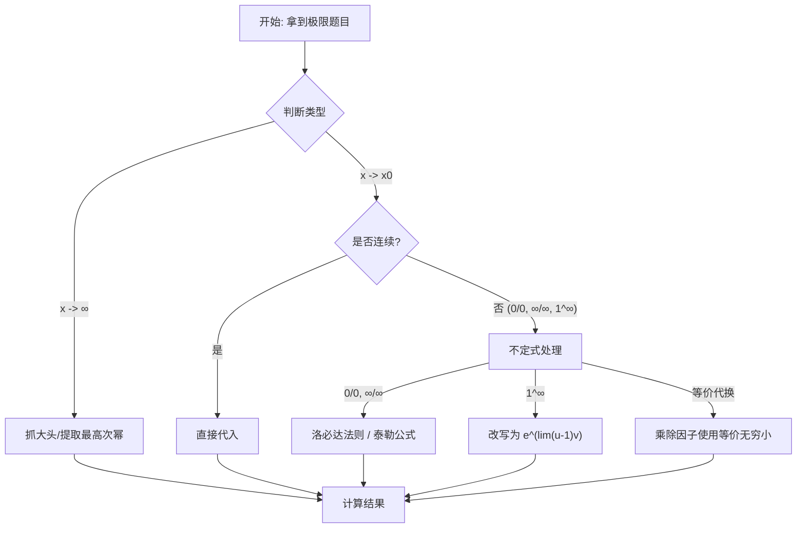

# 考研数学复习资料：高等数学（一）

**章节**：第一章 函数、极限与连续  
**适用对象**：考研数学一/二/三  
**版本**：v1.0  
**最后更新**：2026-03-15

---

## 目录

- [考研数学复习资料：高等数学（一）](#考研数学复习资料高等数学一)
  - [目录](#目录)
  - [第一节 函数 (Functions)](#第一节-函数-functions)
    - [1.1 函数的概念与性质](#11-函数的概念与性质)
    - [1.2 反函数与复合函数](#12-反函数与复合函数)
    - [1.3 初等函数](#13-初等函数)
  - [第二节 极限 (Limits)](#第二节-极限-limits)
    - [2.1 数列的极限](#21-数列的极限)
    - [2.2 函数的极限](#22-函数的极限)
    - [2.3 极限的性质与运算法则](#23-极限的性质与运算法则)
    - [2.4 两个重要极限](#24-两个重要极限)
    - [2.5 无穷小与无穷大](#25-无穷小与无穷大)
  - [第三节 连续 (Continuity)](#第三节-连续-continuity)
    - [3.1 函数的连续性](#31-函数的连续性)
    - [3.2 函数的间断点](#32-函数的间断点)
    - [3.3 闭区间上连续函数的性质](#33-闭区间上连续函数的性质)
  - [第四节 解题方法与技巧 (Methods \& Techniques)](#第四节-解题方法与技巧-methods--techniques)
    - [4.1 求极限的常用方法](#41-求极限的常用方法)
    - [4.2 判断间断点类型的步骤](#42-判断间断点类型的步骤)
  - [第五节 易错点与注意事项 (Pitfalls)](#第五节-易错点与注意事项-pitfalls)
  - [附录：典型例题](#附录典型例题)

---

## 第一节 函数 (Functions)

### 1.1 函数的概念与性质

**定义**：设 $x$ 和 $y$ 是两个变量，$D$ 是一个给定的实数集。如果对于 $D$ 上的每一个 $x$ 值，按照一定的法则 $f$，都有唯一确定的 $y$ 值与之对应，则称 $y$ 为 $x$ 的函数，记作 $y=f(x)$。其中 $x$ 为自变量，$y$ 为因变量，$D$ 为定义域。

**函数的四大基本性质**：

1.  **有界性 (Boundedness)**：
    *   若存在正数 $M$，使得对于一切 $x \in D$，都有 $|f(x)| \le M$，则称 $f(x)$ 在 $D$ 上有界。
    *   *几何意义*：图像夹在直线 $y=M$ 和 $y=-M$ 之间。

2.  **单调性 (Monotonicity)**：
    *   **单调递增**：若对于区间 $I$ 上任意两点 $x_1, x_2$，当 $x_1 < x_2$ 时，恒有 $f(x_1) < f(x_2)$。
    *   **单调递减**：若对于区间 $I$ 上任意两点 $x_1, x_2$，当 $x_1 < x_2$ 时，恒有 $f(x_1) > f(x_2)$。

3.  **奇偶性 (Parity)**：
    *   **偶函数**：$f(-x) = f(x)$，图像关于 $y$ 轴对称。（例：$x^2, \cos x, |x|$）
    *   **奇函数**：$f(-x) = -f(x)$，图像关于原点对称。（例：$x^3, \sin x, \tan x$）
    *   *性质*：奇+奇=奇，偶+偶=偶，奇$\times$奇=偶，偶$\times$偶=偶，奇$\times$偶=奇。

4.  **周期性 (Periodicity)**：
    *   若存在非零常数 $T$，使得对于定义域内的任意 $x$，都有 $f(x+T) = f(x)$，则称 $f(x)$ 为周期函数。
    *   常见的周期函数：$\sin x, \cos x$ ($T=2\pi$), $\tan x$ ($T=\pi$)。

### 1.2 反函数与复合函数

*   **反函数**：若函数 $y=f(x)$ 在某区间上单调，则存在反函数 $x=f^{-1}(y)$。
    *   *性质*：$y=f(x)$ 与 $y=f^{-1}(x)$ 的图像关于直线 $y=x$ 对称。
*   **复合函数**：设 $y=f(u)$， $u=g(x)$，且 $R_g \cap D_f \neq \emptyset$，则 $y=f[g(x)]$ 称为复合函数。

### 1.3 初等函数

由常数和基本初等函数（幂函数、指数函数、对数函数、三角函数、反三角函数）经过有限次四则运算和有限次复合步骤所构成，并可用一个式子表示的函数。

---

## 第二节 极限 (Limits)

### 2.1 数列的极限

**定义**：对于数列 $\lbrace x_n \rbrace$，若存在常数 $A$，对于任意给定的正数 $\varepsilon$（无论它多么小），总存在正整数 $N$，使得当 $n > N$ 时，一切 $x_n$ 都满足 $|x_n - A| < \varepsilon$，则称常数 $A$ 是数列 $\lbrace x_n \rbrace$ 的极限，记作 $\lim_{n \to \infty} x_n = A$。

### 2.2 函数的极限

1.  **自变量趋于无穷大 ($x \to \infty$)**：
    *   $\lim_{x \to \infty} f(x) = A \iff \forall \varepsilon > 0, \exists X > 0, \text{当 } |x| > X \text{ 时}, |f(x) - A| < \varepsilon$。
2.  **自变量趋于有限值 ($x \to x_0$)**：
    *   $\lim_{x \to x_0} f(x) = A \iff \forall \varepsilon > 0, \exists \delta > 0, \text{当 } 0 < |x - x_0| < \delta \text{ 时}, |f(x) - A| < \varepsilon$。

**左极限与右极限**：
*   左极限：$\lim_{x \to x_0^-} f(x) = A$
*   右极限：$\lim_{x \to x_0^+} f(x) = A$
*   **定理**：$\lim_{x \to x_0} f(x) = A \iff \lim_{x \to x_0^-} f(x) = \lim_{x \to x_0^+} f(x) = A$。

### 2.3 极限的性质与运算法则

*   **唯一性**：若极限存在，则唯一。
*   **有界性**：若 $\lim_{x \to x_0} f(x)$ 存在，则 $f(x)$ 在 $x_0$ 的某去心邻域内有界。
*   **保号性**：若 $\lim_{x \to x_0} f(x) = A > 0$，则在 $x_0$ 的某去心邻域内 $f(x) > 0$。

**四则运算法则**：
设 $\lim f(x) = A, \lim g(x) = B$，则：
1.  $\lim [f(x) \pm g(x)] = A \pm B$
2.  $\lim [f(x) \cdot g(x)] = A \cdot B$
3.  $\lim \frac{f(x)}{g(x)} = \frac{A}{B} \quad (B \neq 0)$

### 2.4 两个重要极限

1.  **第一重要极限**（处理 $\frac{0}{0}$ 型三角函数极限）：
    $$ \lim_{x \to 0} \frac{\sin x}{x} = 1 $$
    *推广*：$\lim_{u \to 0} \frac{\sin u}{u} = 1$（$u$ 代表趋于 0 的任意表达式）

2.  **第二重要极限**（处理 $1^\infty$ 型幂指函数极限）：
    $$ \lim_{x \to \infty} \left(1 + \frac{1}{x}\right)^x = e \quad \text{或} \quad \lim_{x \to 0} (1 + x)^{\frac{1}{x}} = e $$

### 2.5 无穷小与无穷大

*   **无穷小**：极限为 0 的变量。
*   **无穷小的比较**：设 $\alpha, \beta$ 是同一过程中的无穷小 ($\lim \alpha = 0, \lim \beta = 0$)，且 $\alpha \neq 0$。
    *   若 $\lim \frac{\beta}{\alpha} = 0$，称 $\beta$ 是比 $\alpha$ **高阶**的无穷小，记作 $\beta = o(\alpha)$。
    *   若 $\lim \frac{\beta}{\alpha} = C \neq 0$，称 $\beta$ 与 $\alpha$ 是**同阶**无穷小。
    *   若 $\lim \frac{\beta}{\alpha} = 1$，称 $\beta$ 与 $\alpha$ 是**等价**无穷小，记作 $\alpha \sim \beta$。

**常用等价无穷小 ($x \to 0$)**：
*   $\sin x \sim x$
*   $\tan x \sim x$
*   $\arcsin x \sim x$
*   $\arctan x \sim x$
*   $e^x - 1 \sim x$
*   $\ln(1+x) \sim x$
*   $1 - \cos x \sim \frac{1}{2}x^2$
*   $(1+x)^\alpha - 1 \sim \alpha x$

---

## 第三节 连续 (Continuity)

### 3.1 函数的连续性

**定义**：若 $\lim_{x \to x_0} f(x) = f(x_0)$，则称 $f(x)$ 在点 $x_0$ 处连续。
*   充要条件：$\lim_{x \to x_0^-} f(x) = \lim_{x \to x_0^+} f(x) = f(x_0)$。

### 3.2 函数的间断点

若 $f(x)$ 在 $x_0$ 处不连续，则 $x_0$ 为间断点。

1.  **第一类间断点**（左右极限均存在）：
    *   **可去间断点**：$\lim_{x \to x_0^-} f(x) = \lim_{x \to x_0^+} f(x) \neq f(x_0)$ （极限存在但不等于函数值）。
    *   **跳跃间断点**：$\lim_{x \to x_0^-} f(x) \neq \lim_{x \to x_0^+} f(x)$。
2.  **第二类间断点**（左右极限至少有一个不存在）：
    *   **无穷间断点**：极限为无穷大。
    *   **振荡间断点**：极限在某范围内振荡（如 $y=\sin \frac{1}{x}$ 在 $x \to 0$ 时）。

### 3.3 闭区间上连续函数的性质

若 $f(x) \in C[a, b]$（在闭区间上连续），则有：
1.  **有界性定理**：$f(x)$ 在 $[a, b]$ 上有界。
2.  **最值定理**：$f(x)$ 在 $[a, b]$ 上必有最大值和最小值。
3.  **介值定理**：若 $m \le \mu \le M$，则 $\exists \xi \in [a, b]$，使得 $f(\xi) = \mu$。
4.  **零点定理**：若 $f(a) \cdot f(b) < 0$，则 $\exists \xi \in (a, b)$，使得 $f(\xi) = 0$。

---

## 第四节 解题方法与技巧 (Methods & Techniques)

### 4.1 求极限的常用方法

**极限计算思维导图**：

1.  **代入法**：对于连续函数，直接代入极限值。
2.  **抓大头**：当 $x \to \infty$ 时，分子分母同除以最高次幂（针对有理分式）。
    *   例：$\lim_{x \to \infty} \frac{3x^2+1}{2x^2-x} = \frac{3}{2}$
3.  **等价无穷小代换**：
    *   *适用场景*：乘除因子可以换，加减项需谨慎（只有当 $\alpha \sim \alpha', \beta \sim \beta'$ 且 $\lim \frac{\alpha'}{\beta'} \neq 1$ 时通常可换，但建议仅在乘除中使用）。
    *   例：$\lim_{x \to 0} \frac{\sin 3x}{\tan 5x} = \lim_{x \to 0} \frac{3x}{5x} = \frac{3}{5}$。
4.  **洛必达法则 (L'Hopital's Rule)**：
    *   *适用条件*：$\frac{0}{0}$ 或 $\frac{\infty}{\infty}$ 型；导数极限存在。
    *   $\lim_{x \to x_0} \frac{f(x)}{g(x)} = \lim_{x \to x_0} \frac{f'(x)}{g'(x)}$。
5.  **泰勒公式 (Taylor Series)**：
    *   处理复杂的 $\frac{0}{0}$ 型极限，比洛必达更通用。
    *   记住常用展开式（如 $e^x, \sin x, \cos x, \ln(1+x)$）。
6.  **幂指函数处理**：
    *   $u(x)^{v(x)} = e^{v(x) \ln u(x)}$。
    *   对于 $1^\infty$ 型：$\lim u(x)^{v(x)} = e^{\lim [u(x)-1]v(x)}$。

### 4.2 判断间断点类型的步骤

1.  求出函数的定义域，找出无定义的点或分段函数的分界点作为**可疑点**。
2.  计算该点处的**左极限**和**右极限**。
3.  根据左右极限的存在情况判断：
    *   都存在且相等 $\to$ 连续（若等于函数值）或 可去间断点（若不等于函数值）。
    *   都存在但不相等 $\to$ 跳跃间断点。
    *   至少一个不存在 $\to$ 第二类间断点。

---

## 第五节 易错点与注意事项 (Pitfalls)

1.  **极限存在的条件**：
    *   $\lim_{x \to x_0} f(x)$ 存在必须要求左右极限都存在且相等。做题时（特别是分段函数、绝对值函数、$e^{1/x}$ 型）要自觉讨论左右极限。
2.  **洛必达法则的陷阱**：
    *   只能用于 $\frac{0}{0}$ 或 $\frac{\infty}{\infty}$。
    *   求导后极限必须存在。若 $\lim \frac{f'}{g'}$ 不存在，不代表原极限不存在，此时洛必达失效，需改用夹逼定理或定义法。
3.  **等价无穷小代换的误区**：
    *   切记：**“代换只能在乘除中进行，加减中一般不能代换”**。
    *   错误示例：求 $\lim_{x \to 0} \frac{\tan x - \sin x}{x^3}$。
        *   错解：$\tan x \sim x, \sin x \sim x \implies \lim \frac{x-x}{x^3} = 0$。
        *   正解：$\tan x - \sin x = \tan x (1 - \cos x) \sim x \cdot \frac{1}{2}x^2 = \frac{1}{2}x^3$，故极限为 $\frac{1}{2}$。
4.  **$1^\infty$ 型极限**：
    *   不要直接把底数极限算出来再乘指数极限，必须使用 $e^{\lim (u-1)v}$ 公式。

---

## 附录：典型例题

**例 1**：求极限 $\lim_{x \to 0} \frac{e^x - 1 - x}{\arcsin(x^2)}$。

**解析**：
此为 $\frac{0}{0}$ 型。
分母：$\arcsin(x^2) \sim x^2$。
分子：使用泰勒公式，$e^x = 1 + x + \frac{x^2}{2} + o(x^2)$。
$$ \lim_{x \to 0} \frac{(1 + x + \frac{x^2}{2} + o(x^2)) - 1 - x}{x^2} = \lim_{x \to 0} \frac{\frac{1}{2}x^2}{x^2} = \frac{1}{2} $$

**例 2**：判断 $f(x) = \frac{x}{\sin x}$ 在 $x=0$ 处的间断点类型。

**解析**：
$x=0$ 处函数无定义，为间断点。
计算极限：$\lim_{x \to 0} f(x) = \lim_{x \to 0} \frac{x}{\sin x} = 1$。
极限存在，但函数无定义，故 $x=0$ 是**第一类可去间断点**。
补充定义 $f(0)=1$ 后，函数变为连续。

---
*祝复习顺利！*
